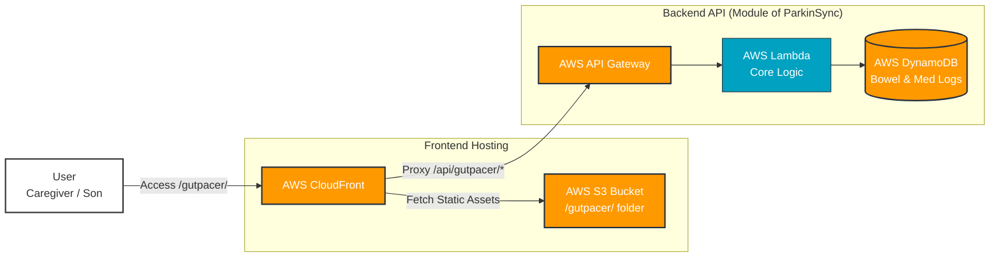

# GutPacer // Intestinal Pace Tuner & Bowel Tracker
### // 腸のペースを整える排便トラッカー // Module of ParkinSync

  

---

## 🌟 Project Overview

**GutPacer** is a secure, serverless Web application module designed for caregivers and patients with Parkinson's Disease (PD). It enables efficient tracking of bowel movements and Movicol medication intake to collect critical data for analysis of medication effectiveness and symptom patterns.

### 🚫 The Personal Problem & Stakeholder (PM Focus)
The project was born out of a personal need. My father, who has Parkinson's Disease, suffers from severe constipation—a very common non-motor symptom of PD. His caregiver (helper) prepares his luggage for facility stays, but tracking his intestinal health has been error-prone. This module provides a single point of truth for caregivers (stakeholders) to manage and monitor his gut health.

### 🧠 Medical & Data Science Importance (MSCS Focus)
In Parkinson's Disease, **Constipation** is not just a daily discomfort. It significantly aggravates the absorption of L-dopa medication (such as EC-Dopal), leading to delayed gastric emptying. This results in debilitating "Delayed-on" or "Wearing-off" phenomena where medication effect is delayed or shortened. 

Finding the unique **"Pace" (Pattern)** of bowel movements in relation to medication is crucial for optimizing treatment and improving quality of life (QoL). This module defines and collects the essential data primitives (features) for future machine learning and pattern discovery.

---

## 📋 Functional Primitives (Key Features)

This module defines and tracks the following essential health primitives (data items) through a user-friendly interface. All data entries are designed for **Agile, high-velocity input (under 30 seconds)** by caregivers in the field.

### 📋 Bowel Tracker
Track Bowel Movements (BM).
* **Time:** Automatic timestamp primitives.
* **Amount:** Selectable (Small, Medium, Large).
* **Type:** Bristol Stool Chart based options (Lumpy, Sausage-like, Mushy, etc.).

### 💊 Medication Tracker
Track Movicol intake.
* **Movicol (1日3回):** Checkboxes for morning, noon, evening intake.
* *(Future roadmap primitives: L-dopa intake time and duration of effectiveness).*

---

## 📊 System Architecture & Tech Stack (MSCS Focus)

This module operates on a secure, highly available, and decoupled AWS Serverless infrastructure, designed for low-latency data entry and secure persistence.

### 🛠️ Infrastructure Components:
*   **AWS CloudFront:** Global Content Delivery Network (CDN) ensuring immediate loading of the tracker interface for caregivers. Supports clean URL handling via CloudFront Functions.
*   **AWS S3:** Secure object storage hosting the static single-page application (SPA) frontend assets.
*   **AWS API Gateway:** Fully managed, secure entry point for routing backend API requests.
*   **AWS Lambda:** Serverless computing backend executing validation and data routing logic without provisioning servers.
*   **AWS DynamoDB:** NoSQL database optimized for high-velocity, structured health logs, laying the analytical foundation for future ML pattern discovery.
*   **Frontend Tech:** JavaScript, Tailwind CSS. Secure and lightweight by default.

---

## 🏁 Product and Project Management

GutPacer uses **iterative, evidence-led Agile delivery**. It does not claim that a solo project ran formal Scrum ceremonies. The public management trail connects caregiver problems to personas, user stories, acceptance criteria, implementation, verification, release decisions, and incident learning.

- [Delivery management and Definition of Done](docs/PROJECT_MANAGEMENT.md)
- [Personas, user stories, and product strategy](docs/STRATEGY.md)
- [10-to-30-family roadmap](docs/GROWTH_PLAN.md)
- [Delivered work and verification evidence](docs/TASKS.md)
- [Human-only decisions and dependencies](docs/USER_TODO.md)

New work uses structured GitHub User Story and Delivery Task forms. Issues and pull requests can be automatically added to the **GutPacer Delivery** GitHub Project, while pull requests retain acceptance evidence, risk review, and decision context.

The current production version is a single-family, PIN-protected tool. LINE identity, server-enforced user isolation, and per-user notifications are being developed for a small closed beta. General availability is not claimed.
