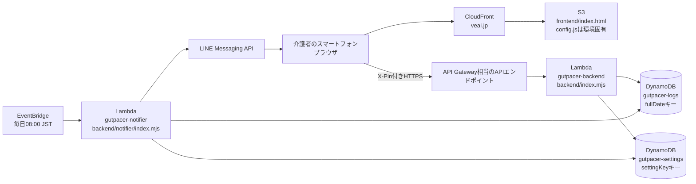
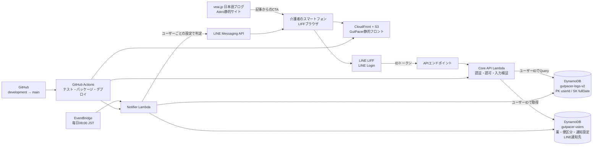

# GutPacer 全体アーキテクチャ

最終更新: 2026-07-15

## 1. 位置づけ

GutPacer は、パーキンソン病のある方を介護する家族が、排便・服薬・施設滞在の情報を記録し、必要なタイミングでLINE通知を受け取るためのWebアプリである。診断や治療方針を提供するサービスではなく、記録・気づき・受診時の共有を支援する。

## 2. 現在の構成

現在は一つの家族向けのシングルテナント構成である。

補足:

- フロントエンドは静的HTML/CSS/JavaScriptで、S3から配信する。
- API Lambdaは `X-Pin` ヘッダーで認証する。現状のPIN認証は一家庭向けの暫定構成である。
- 通知LambdaはEventBridgeからJSTの朝に起動し、排便記録を確認してLINEへ通知する。
- DynamoDBはPITRを有効化済み。LambdaとDynamoDBは `us-east-1` にある。
- `frontend/config.js` はデプロイ環境固有のため、Git管理しない。

## 3. 10〜30家族向けの目標構成

拡大時は、ログインしたLINEユーザーIDをすべてのデータアクセスの境界にする。認証とデータ分離を先に実装し、その後に薬・便の選択肢・通知しきい値をユーザープロファイルから描画する。

ブログはアプリのデータ系統とは分離した認知獲得レイヤーとして扱う。検索から記事に来た読者を、介護者向けの説明ページ、LINE公式アカウント、LIFFアプリへ段階的に案内する。ブログ側からAPIやDynamoDBへ直接アクセスさせない。

### データ境界

| データ | 主キー | 用途 |
|---|---|---|
| `gutpacer-logs-v2` | `userId` + `fullDate` | 日々の排便・服薬・メモ・場所 |
| `gutpacer-users` | `userId` | LINEプロフィール、薬、便区分、通知しきい値、場所 |

既存の `gutpacer-logs` / `gutpacer-settings` は、移行確認が終わるまで削除しない。移行スクリプトで既存家庭の記録を新しい `userId` にコピーし、旧構成はロールバック用に保持する。

## 4. リクエストと通知の流れ

1. 介護者がLINEからLIFFアプリを開く。
2. フロントエンドがLIFFのIDトークンをAPIへ送る。
3. API LambdaがLINE側でトークンを検証し、トークン中のユーザーIDを取得する。
4. API Lambdaは、リクエスト本文のユーザーIDを信用せず、検証済みトークンのユーザーIDだけでDynamoDBをQueryする。
5. 記録・設定変更は、そのユーザーのパーティションにだけ保存する。
6. 通知Lambdaはユーザープロファイルを走査し、ユーザーごとの通知設定と場所を使って判定する。
7. 1ユーザーへのLINE送信失敗が、他ユーザーの判定・送信を止めないようにする。

## 5. 開発順序

1. `G-1`: LIFFログインとIDトークン検証
2. `G-2`: DynamoDBのユーザー単位分離と既存データ移行
3. `G-4`〜`G-6`: プロファイル、動的フォーム、初回設定
4. `G-7`: ユーザーごとのLINE通知
5. `G-8`〜`G-10`: データ削除、規約、運用監視、PWA

`G-2` 完了前に複数家族へ配布しない。認証だけを先に入れても、日付だけをキーにした旧テーブルを共有するとデータ分離にならないためである。

## 6. 運用上の原則

- Lambda、DynamoDB、LINEの秘密情報はコードやブログに記載しない。
- 本番のデプロイ先は `main`、開発は `development` とする。
- API変更前にオフラインの `npm test` を実行する。
- 個人情報・健康情報を扱うため、公開前に運営者名義、問い合わせ先、削除方針、プライバシーポリシーを確定する。
- 表現は「記録」「共有」「通知」に限定し、診断・治療・改善効果を約束しない。
